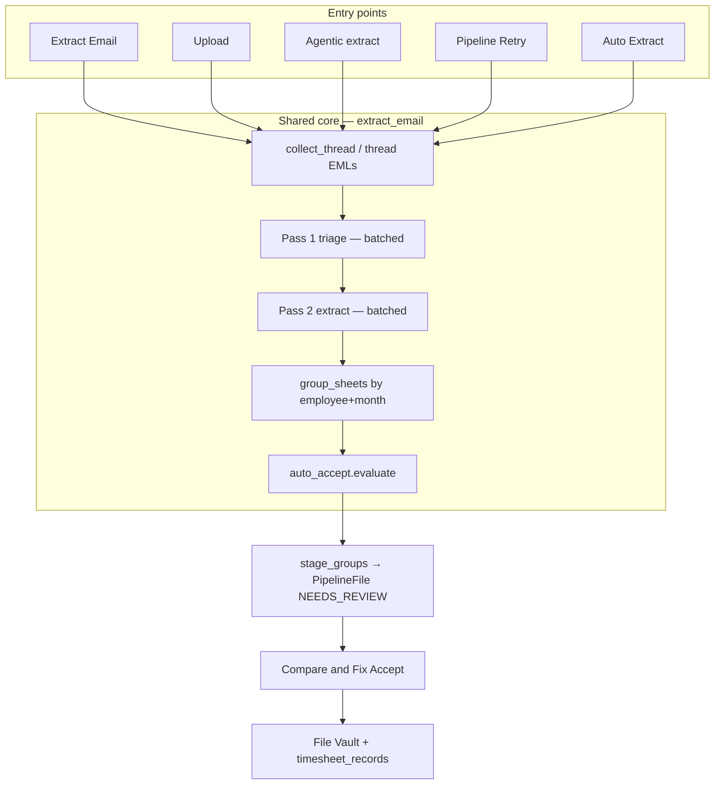

# Extraction Flows — End-to-End Reference

Accurate walkthrough of every path that turns documents into staged pipeline
items and (after human Accept) into File Vault + `timesheet_records`.

Source of truth: currently **wired** code. Shorter overview:
[`SYSTEM.md`](SYSTEM.md). Prompt / Pass 1–2 detail:
[`EXTRACTION_TWO_PASS.md`](EXTRACTION_TWO_PASS.md).

**Core package:** [`backend/app/services/extract_email/`](../backend/app/services/extract_email/)  
(Legacy import shim: `services/agents/full_email_extract.py` — re-exports only.)

**API prefix:** all routes below are under `/api/v1`.

---

## 1. Overview

Four extract entry points share one analysis core (thread two-pass). Vault
filing is a **separate human step** (Compare & Fix Accept). Date checks and
summaries are plain Python — no second “validation LLM”.

| # | Path | Frontend | API | Stages `PipelineFile`? | Vision LLM? |
|---|------|----------|-----|------------------------|-------------|
| 1 | Extract Email | Inbox | `POST /inbox/{id}/extract-full` | Yes (`source_kind=email`) | Yes |
| 2 | Upload | Upload page | `POST /upload` | Yes (`source_kind=upload`) | Yes |
| 3 | Agentic | Agentic Chat | `POST /agentic-chat/extract` then optional `.../store` | Extract: no; Store: yes | Yes |
| 4 | Pipeline Retry | Pipeline | `POST /pipeline/{id}/retry` | In-place re-analyse | Yes |

**Shared vault step (no LLM):** Compare & Fix Accept →
`POST /pipeline/{id}/manual-fix` → `ingest_manual_entry` → File Vault + DB.

Related (not vision extract):

- **Manual Entry** — `POST /upload/manual` → vault immediately.
- **Save .eml to vault** — `POST /inbox/{id}/as-eml/save-to-vault` — files `.eml` only (uses ACO/DCO folder when `employee_pk` is sent).
- **Auto Extract** — background loop over non-archived threads; skips when already extracted and nothing newer arrived (`last_at >= newest_at`).


```mermaid
flowchart TD
  subgraph entry [Entry points]
    Email[Extract Email]
    Upload[Upload]
    Agentic[Agentic extract]
    Retry[Pipeline Retry]
    Auto[Auto Extract]
  end

  subgraph core [Shared core — extract_email]
    Collect[collect_thread / thread EMLs]
    P1[Pass 1 triage — batched]
    P2[Pass 2 extract — batched]
    Group[group_sheets by employee+month]
    Gate[auto_accept.evaluate]
  end

  Stage[stage_groups → PipelineFile NEEDS_REVIEW]
  Accept[Compare and Fix Accept]
  Vault[File Vault + timesheet_records]

  Email --> Collect
  Upload --> Collect
  Agentic --> Collect
  Retry --> Collect
  Auto --> Collect
  Collect --> P1 --> P2 --> Group --> Gate --> Stage
  Stage --> Accept --> Vault
```

---

## 2. Shared core (vision paths)

### 2.1 Collect

- Inbox: `thread_collect.collect_thread_emls` → raw `.eml` bytes per message
  (incremental window: new + a couple of prior messages when re-extracting).
- Upload: wrap file as a single-message thread (or parse `.eml` / nested mail).
- `thread_extract.collect_thread` walks MIME: PDFs, Office, images; **unwraps
  nested `.eml`/`.msg`** so inner sheets become analysable items. Outer `.eml`
  container names are recorded for Inbox Extracted badges.

### 2.2 Pass 1 + Pass 2

See [`EXTRACTION_TWO_PASS.md`](EXTRACTION_TWO_PASS.md).

| Pass | Module | Batches by | Output |
|------|--------|------------|--------|
| 1 | `triage_prompt.py` | item count (`PASS1_BATCH_SIZE`) | classify, approval, thread summary |
| 2 | `thread_prompt.py` | images (`MAX_IMAGES_PER_CALL`) | leave buckets + day accounting |

Call count is **≥ 2** and rises when batches are needed — not a fixed “2 regardless of sheet count”.

### 2.3 Group → stage

`grouping.group_sheets`:

1. Keep `timesheet` + `leave_certificate` sheets.
2. Match each to HR matcher (`employee_pk` or raw key).
3. **One group = one employee + one month/year.**
4. Multiple sheets for the same person+month → **union** leave buckets.
5. Several people in one email → **several groups**.

`staging.stage_groups`:

- One `PipelineFile` **per group** (tag `__email_extract__:<digest>`).
- All groups from the same run share the **same raw `.eml` bytes** (each row
  gets its own `raw_path` copy under that tracker’s id).
- Meta includes `full_email_extract.group_count` (= number of groups in the run)
  and per-group `sheets[]` (with filenames) for Accept-time isolation.
- Always `NEEDS_REVIEW`. AI may set `auto_accept.accepted` as a **recommendation only**.

---

## 3. How groups relate to vault rules

### Group creation (example)

Manager email with 8 PDFs (one per employee, all June) → Pass 2 yields 8 sheets
→ `group_sheets` → **8 groups** → **8 Review rows**. Compare & Fix still opens
the shared thread evidence for context.

### On Accept — Rule: multi-employee vs single

| `group_count` | What is filed to that employee’s vault |
|---------------|----------------------------------------|
| `1` | Whole thread `.eml` (provenance: body, approval, context) |
| `> 1` | **Only that employee’s own attachment(s)** matched by filename inside the shared `.eml` (`isolate_employee_attachments`). If any expected filename can’t be found confidently → fall back to whole `.eml` (safe). |

Code: `pipeline.py` (`manual-fix`) → `isolate_employee_attachments` →
`ingest_manual_entry`.

### On Accept — Rule: never overwrite

`storage_provider.save_file` → `_dedupe_filename`:

- Name free → save as-is.
- Name exists → `Subject — YYYY-MM-DD.ext`.
- Same day again → `Subject — YYYY-MM-DD (2).ext`, …

Original bytes are never replaced. Applies to Accept and Save-to-Vault (shared helper).

### Folder naming — ACO / DCO

`ensure_employee_folder(manager, name, aco, dco)` →  
`Jane Doe (ACO-1, DCO-2)` (whichever numbers exist).  
Used by Accept (`ingest_manual_entry`) and Save-to-Vault (when `employee_pk` is provided).  
If a bare-name folder already exists for that person, it is **renamed** rather than duplicated.

---

## 4. Entry points (short)

### 4.1 Extract Email

`POST /inbox/{id}/extract-full` → `extract_full_email` → two-pass → `stage_groups`.  
SSE live progress on streaming variants. Inbox shows thread summary
(`ThreadSummaryBox`, expanded by default) and status badges.

### 4.2 Upload

`POST /upload` → same core with `source_kind=upload`.

### 4.3 Auto Extract

`services/extract_email/auto_extract.py` — loops non-`ARCHIVED` threads.  
**Skip** (no Graph fetch, no model) when `sheet_cache.last_extraction_at(thread) >= newest message`.  
Manual Extract Email may still re-send a thread on purpose; Auto Extract must not.

### 4.4 Retry

`POST /pipeline/{id}/retry` — re-read raw copy → refresh staged meta; **no vault write**.

---

## 5. Accept → File Vault

### 5.1 Frontend

`PipelineCompareFixModal` → `pipelineManualFix` →  
`POST /pipeline/{id}/manual-fix` (multipart: `employee_pk`, month/year, buckets, optional approval, optional files).

### 5.2 Backend

```
pipeline_manual_fix
  → if no replacement files: read_raw_copy
  → isolate_employee_attachments (when group_count > 1) else whole raw
  → ingest_manual_entry  # NO LLM
  → mark PipelineFile SUCCESS; purge_raw_copy
  → mark_source_email_ingested (email-sourced)
```

`ingest_manual_entry`:

1. Load matcher employee (refresh ACO/DCO).
2. Merge `source_files` / union buckets; `validate` + `summarize`.
3. `ensure_employee_folder` → `save_file` (with dedupe) under  
   `<Manager>/<Name (ACO-…, DCO-…)>/<Month-Year>/`.
4. Upsert `TimesheetRecord`; set `storage_folder`.

**Nothing is permanently filed until Accept** (except Manual Entry and Save-to-Vault).

---

## 6. Inbox UI notes (extract-related)

| Badge | Color | Meaning |
|-------|-------|---------|
| New | Dark blue | Email status / attachment not yet covered by last extract |
| Extracted | Yellow | Extract Email ran (thread) / message covered by watermark |
| Ingested | Green | Accepted & filed |

Attachment **New/Extracted** chips trust the **message extract watermark** (so nested `.eml` wrappers don’t falsely show New after unwrap).  
Thread summary: `ThreadSummaryBox` with `defaultOpen` on the conversation view.

---

## 7. API cheat sheet

| Method | Path | Role |
|--------|------|------|
| `POST` | `/inbox/{id}/extract-full` | Extract Email → stage |
| `GET` | `/inbox/{id}/llm-preview` | Scrubbed prompt/images audit |
| `POST` | `/inbox/{id}/as-eml/save-to-vault` | File `.eml` (ACO/DCO folder via `employee_pk`) |
| `POST` | `/upload` | Upload extract → stage |
| `POST` | `/upload/manual` | Manual → vault |
| `POST` | `/pipeline/{id}/retry` | Re-analyse raw |
| `POST` | `/pipeline/{id}/manual-fix` | Accept → vault + record |

---

## 8. Persistence matrix

| Step | `pipeline_files` | pipeline-raw | File Vault | `timesheet_records` | Inbox |
|------|------------------|--------------|------------|---------------------|-------|
| Extract / Upload / store | NEEDS_REVIEW | yes | no | no | Extracted badge |
| Retry | update meta | keep | no | no | — |
| Accept | SUCCESS | purged | yes (deduped; isolated if multi) | yes | → `ingested` |
| Manual / Save-to-vault | tracker / none | — | yes | yes / no | — |

---

## 9. Key source files

| Concern | Path |
|---------|------|
| Two-pass orchestration | `services/extract_email/thread_extract.py` |
| Pass 1 / Pass 2 prompts | `triage_prompt.py` / `thread_prompt.py` |
| Grouping | `grouping.py` |
| Staging + `group_count` | `staging.py` |
| Auto Extract skip | `auto_extract.py` |
| Accept + isolate + folder | `pipeline/ingestion.py`, `api/routes/pipeline.py` |
| Vault dedupe + ACO label | `storage_provider/__init__.py` |
| Save-to-vault | `api/routes/inbox.py` |
| Inbox badges / summary | `frontend/src/pages/Inbox.tsx`, `ThreadSummaryBox.tsx` |
